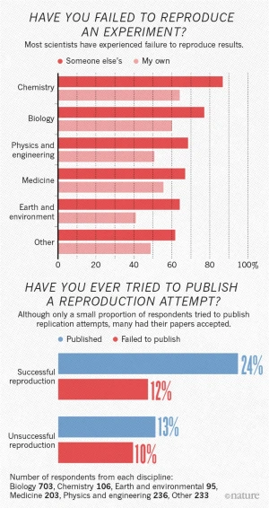
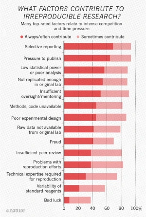

--- 
title: "R Markdown + R in the Cloud"
subtitle: ""
author: "Dr Maria Rivera Araya"
institute: "Senior Scientific Data Specialist ASDI(DIML)/SIS"
date: "12/04/2022"
output:
  xaringan::moon_reader:
    lib_dir: libs
    nature:
      highlightStyle: github
      highlightLines: true
      countIncrementalSlides: false
      self_contained: true


---

# Agenda

- Introduction to Rmarkdown
- Introduction to R projects
- Demo
- Short tutorial
- R in the cloud

---
class: center, middle


RMarkdown and R Projects are tools to improve **reproducibility** and efficiency


```{r echo=FALSE}

```


---

class: center, middle

```{r echo=FALSE}

```

Source: Baker, M. 1,500 scientists lift the lid on reproducibility. Nature 533, 452–454 (2016). https://doi.org/10.1038/533452a

---
# R Markdown

R + markdown


```{r echo=FALSE}
knitr::include_graphics("libs/workflow.png")
```

---
# Markdown syntax

```{r echo=FALSE}
knitr::include_graphics("libs/mkexample.png")
#remotes::install_github("yihui/xaringan")
```


???

Markdown is a lightweight markup language for creating formatted text using a plain-text editor. 

---
# Why R Markdown?

- Reproducibility
- Allows literate programming (A blend of your literature (text), and your programming (code))
- Organisation
---
# Let's try R Markdown

```{r eval=FALSE}

install.packages("pacman")

pacman::p_load(rmarkdown, knitr, here, fs, usethis) 

# same as 

install.packages("rmarkdown")
install.packages("knitr")
install.packages("here")
install.packages("tidyverse")
install.packages("fs")
install.packages("usethis")

library(rmarkdown)
library(knitr)
library(here)
library(tidyverse)
library(fs)
library(usethis)


```

---
# Why R projects?

- Reproducibility
- Efficiency
- Avoid dealing with file paths

```{r eval=FALSE}

data <- read_csv("c:/really/long/file/path/to/this/directory/data/mydata.csv")

gapminder <- read_csv("/Users/mriveraaraya/Desktop/tutorial/gapminder.csv")

```

One way around it:
```{r eval=FALSE}

setwd("c:/really/long/file/path/to/this/directory")
```
But what happens if you want to share it with a colleague/collaborator?

```{r}

```

---
# Let's try a solution together

## R projects

- Keep all your files together
- Set the working directory to the project directory
- Starts a new session of R
- Restore previously edited files into the editor tabs
- Restore other Rstudio settings
- Allow for multiple R projects open at the same time.

---
# Tutorial

1. [Example of R project](https://github.com/mariariveraaraya/rmarkdowntutorial/raw/main/Rmarkdown.zip)

- Download this zip file

- Unzip/extract contents

- Click on Rmarkdown.Rproj


---
# Resources

- [R Markdown for scientists](https://rmd4sci.njtierney.com/)
- [R Markdown: The Definitive Guide](https://bookdown.org/yihui/rmarkdown/)
- [R Markdown Cheatsheet](https://rmarkdown.rstudio.com/lesson-15.HTML)
- [R Markdown Cookbook](https://bookdown.org/yihui/rmarkdown-cookbook/)


